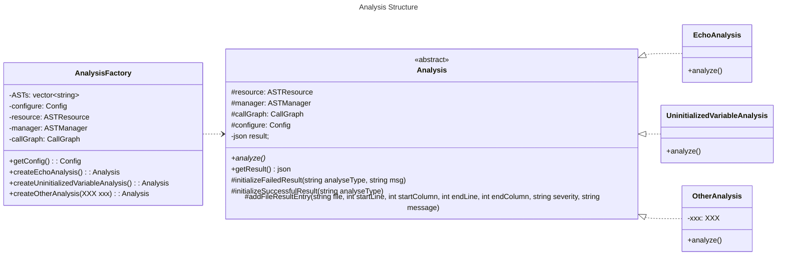

# Contributing Guideline

> Jiacai Cui


## Change Log

| Date      | Change                            |
| --------- | --------------------------------- |
| 2023.4.2  | The first version                 |
| 2023.4.12 | Change result obtaining mechanism |


## For Client Contributors

### What are provided?

We provide **an abstract class** `analysis::Analysis` and **a factory class** `analysis::AnalysisFactory` for clients.

```cpp
namespace analysis {
    
/// @brief interface class for all analysis
class Analysis 
{
public:
    Analysis(ASTResource& resource, ASTManager& manager, CallGraph& callGraph, Config& configure);

    ~Analysis() = default;

    /// @brief perform the analysis
    virtual void analyze()=0;
    
    /// @brief get the result of analysis
    /// @return a json object
    const json& getResult();
};

class AnalysisFactory {
public:
    AnalysisFactory(std::string astListFilePath, std::string configFilePath);
    Config& getConfigure();
    std::unique_ptr<Analysis> createEchoAnalysis();
    std::unique_ptr<Analysis> createUninitializedVariableAnalysis();
    // more analysis factory method to come ...
}

}
```

### How to use?

The clients should perform analysis like below.

**Step01**: Create an analysis factory for given **ast list file** and **configuration file**.

```cpp
analysis::AnalysisFactory analysisFactory(
        "/home/ubuntu/StaticAnalyzer-Algorithm/tests/test_uninit_var/astlist.txt",
        "/home/ubuntu/StaticAnalyzer-Algorithm/tests/test_uninit_var/config.txt");
```

> Absolute path recommended, since relative path might be quite confusing.

**Step02**: Generate an analysis corresponding to a specific program and configuration using factory methods.

```cpp
std::unique_ptr<analysis::Analysis> uni = analysisFactory.createUninitializedVariableAnalysis();
```

**Step03**: Call `analyze()` method to perform analysis.

```cpp
uni->analyze();
```

**Step04**: Call `getResult()` to get a json object representing the analysis result. 

```cpp
json result = uni->getResult();
// call result.dump() will give you a string representation of the json object
// you can also use result to construct other json objects
std::cout << result.dump() << std::endl;
```

### A Preview Example

To preview the results of echo analysis example, first modify the absolute path in `tests/test_uninit_var/astlist.txt` and `tests/test_uninit_var/echo_test.cpp` to make them correspond to your environment.

Then, generate the ast file of `tests/test_uninit_var/example.cpp`.

```shell
cd tests/test_uninit_var
clang++ -emit-ast -c example.cpp
```

Finally, in the project root directory, run

```shell
mkdir build
cd build
cmake ..
make
ctest -R UnInitVarTest.Test1 -V
```

And you'll see what will `uni->analyze()`   and `uni->getResult()`give you.

> Note that `3:` in the beginning of each line is just prompt from google test, not part of `uni->analyze()`  and `uni->getResult()`.

### How to build?

Suppose `your_target` is the target you want to build. You need to link libraries include but not limited to what are linked below.

```cmake
target_link_libraries(
	your_target
    analysis
    framework
    ${CLANG_LIBS}
    ${LLVM_LIBS}
    ${OTHER_LIBS}
    // ......
)
```


## For Algorithm Contributors

The header files should be put in `include/analysis` and its subdirectories. The source files should be put in `lib/analysis` and its subdirectories. All classes concering analysis should be put in namespace `analysis` .

### Current Class Structure




So far,  `EchoAnalysis` and  `UninitializedVariableAnalysis`  are implemented. `OtherAnalysis` is just a conceptual demonstration for contributors to reference.

### How to Contribute?

**Step01**: Add a new class that implements `Analysis`, like `OtherAnalysis` . 

> Conventionally, `resource`, `manager`, `callGraph`, `config` are what you'll have access to that representing the program to be analyzed.

There're also three protected functions implemented in `Analysis` that you can take advantage of to generate analysis results.

```cpp
/// @brief initialize the result as a failed result
/// @param analyseType analysis algorithm type
/// @param msg error message
void initializeFailedResult(const std::string& analyseType, const std::string& msg);

/// @brief initialze the result as a successful result
/// @param analyseType analysis algorithm type
void initializeSuccessfulResult(const std::string& analyseType);

/// @brief add a file result entry
/// @param file path of the file being analyzed
/// @param startLine error location start line (indexed from 1)
/// @param startColumn error location start column (indexed from 1)
/// @param endLine error location end line (included)
/// @param endColumn error location end column (excluded)
/// @param severity severity level: Hint, Info, Warning, Error
/// @param message error message
void addFileResultEntry(const std::string& file, 
    int startLine, int startColumn, int endLine, int endColumn, 
    const std::string& severity, const std::string& message);
```

- If you fail to analyze the program, just call `initializeFailedResult`  to initialize a failed result and return in `analyze()`.

- If you successfully analyze the program, you should 

    - First call `initializeSuccessfulResult` to initialize a successful result.
    - Then, call `addFileResultEntry` to add result entries.

    > Note that you should not call `addFileResultEntry` before you call `initializeSuccessfulResult` 。

**Step02**: Add a factory method in `AnalysisFactory` to instantiate your analysis, like `createUninitializedVariableAnalysis` and `createOtherAnalysis`. 

> You need to pass what you need to your analysis in this factory method if necessary.
>
>  `resource`, `manager`, `callGraph`, `config` are compulsory, while you also can ask clients to provide additional informations by adding parameters to factory methods. For example, 
>
> ```cpp
> unique_ptr<Analysis> createOtherAnalysis(bool flag, int integer);
> ```
>
> The factory method above can ask client to privide a boolean flag and an integer.

**Step03**: Add a test case for your analysis in `tests` directory. You can take `tests/test_echo` or `tests/test_uninit_var` as an example to figure out how to write a google unit test.

