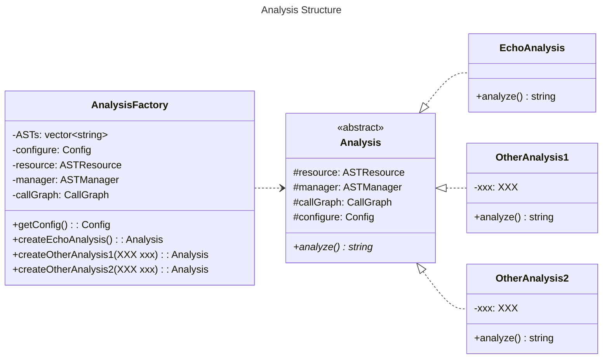

# Contributing Guideline

> Jiacai Cui


## For Client Contributors

### What are provided?

We provide **an interface** `analysis::Analysis` and **a factory class** `analysis::AnalysisFactory` for clients.

```cpp
namespace analysis {
    
class Analysis {
public:
    virtual std::string analyze()=0;
}

class AnalysisFactory {
public:
	AnalysisFactory(std::string astListFilePath, std::string configFilePath);
    Config& getConfigure();
    std::unique_ptr<Analysis> createEchoAnalysis();
    // more analysis factory method to come ...
}

}
```

### How to use?

The clients should perform analysis like below.

**Step01**: Create an analysis factory for given **ast list file** and **configuration file**.

```cpp
analysis::AnalysisFactory analysisFactory(
        "/home/ubuntu/StaticAnalyzer-Algorithm/tests/test_echo/astlist.txt",
        "/home/ubuntu/StaticAnalyzer-Algorithm/tests/test_echo/config.txt");
```

> Absolute path recommended, since relative path might be quite confusing.

**Step02**: Generate an analysis corresponding to a specific program and configuration using factory methods.

```cpp
std::unique_ptr<analysis::Analysis> echo = analysisFactory.createEchoAnalysis();
```

**Step03**: Call `analyze()` method to get results. 

```cpp
std::cout << echo->analyze() << std::endl;
```

### A Preview Example

To preview the results of echo analysis example, first modify the absolute path in `tests/test_echo/astlist.txt` and `tests/test_echo/echo_test.cpp` to make them correspond to your environment.

Then, generate the ast file of `tests/test_echo/example.cpp`.

```shell
cd tests/test_echo
clang++ -emit-ast -c example.cpp
```

Finally, in the project root directory, run

```shell
mkdir build
cd build
cmake ..
make
ctest -R EchoTest.Test1 -V
```

And you'll see what will `echo->analyze()` give you.

> Note that `3:` in the beginning of each line is just prompt from google test, not part of `echo->analyze()` .

### How to build?

Suppose `your_target` is the target you want to build. You need to link libraries include but not limited to what are linked below.

```cmake
target_link_libraries(
	your_target
    analysis
    framework
    ${CLANG_LIBS}
    ${LLVM_LIBS}
    ${OTHER_LIBS}
    // ......
)
```


## For Algorithm Contributors

The header files should be put in `include/analysis` and its subdirectories. The source files should be put in `lib/analysis` and its subdirectories. All classes concering analysis should be put in namespace `analysis` .

### Current Class Structure



So far, only `EchoAnalysis`  and `createEchoAnalysis` is implemented. `OtherAnalysis1` and `OtherAnalysis2` is just conceptual demonstrations.

### How to Contribute?

**Step01**: Add a new class that implements `Analysis`, like `OtherAnalysis1` and `OtherAnalysis2`. 

> Conventionally, `resource`, `manager`, `callGraph`, `config` are what you'll have access to.

**Step02**: Add a factory method in `AnalysisFactory` to instantiate your analysis, like `createOtherAnalysis1` and `createOtherAnalysis2`. 

> You need to pass what you need to your analysis in this factory method.
>
>  `resource`, `manager`, `callGraph`, `config` are compulsory, while you also can ask clients to provide additional informations by adding parameters to factory methods. For example, 
>
> ```cpp
> unique_ptr<Analysis> createOtherAnalysis1(bool flag, int integer);
> ```
>
> The factory method above can ask client to privide a boolean flag and an integer.

**Step03**: Add a test case for your analysis in `tests` directory. You can take `tests/test_echo` as an example to figure out how to write a unit test.

